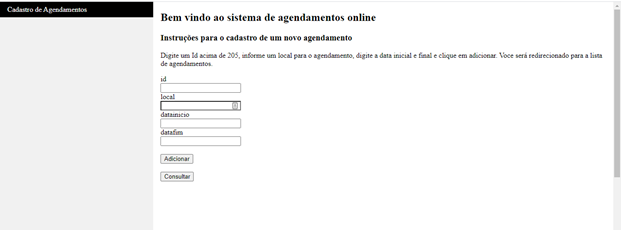

# Sistema de Agendamentos

O sistema é uma aplicação Web que gerencia agendamentos online. Sua base conceitual inclui um CRUD com Node.js construído na arquitetura MVC.

# Tecnologias Utilizadas 

-HTML5/CSS3;

-FrameWork Express-HandleBars;

-JavaScript;

-Node.js;

-Banco de dados SQLite;

-IDE SQLiteStudio;

-FrameWork Sequelize;

-FrameWork SQLite3;

-FrameWork Express;

-FrameWork Body-Parser;

-Módulo Nodemon;

-Visual studio code;

# Telas

# Execução 

Usando o git execute até o passo 2 e então o terminal para os demais passos ou execute todos os passos no terminal do Visual Studio Code.

Passo 1: Clone o repositório;
Passo 2: Execute o comando "git pull origin master" na pasta gerada para importar as alterações;
Passo 3: Execute o comando "npm install" para instalar os módulos;
Passo 4: Execute o arquivo "app.js" no terminal com o comando: "node app.js" ou "nodemon app.js"
Passo 5: No navegador Chrome digite “localhost:8080”
