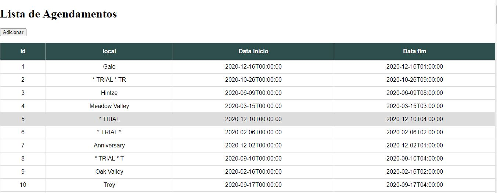

# Sistema de Agendamentos (Em Manutenção)

O sistema é uma aplicação Web que gerencia agendamentos online. Sua base conceitual inclui um CRUD com Node.js construído na arquitetura MVC.

# Tecnologias Utilizadas 

-HTML5/CSS3;

-FrameWork Express-HandleBars;

-JavaScript;(Back-end e Front-end);

-Node.js;

-Banco de dados SQLite;

-IDE SQLiteStudio;

-FrameWork Sequelize;

-FrameWork SQLite3;

-FrameWork Express;

-FrameWork Body-Parser;

-Módulo Nodemon;

-Visual studio code;

# Funcionalidades: 

Inclusão de agendamentos: ok; 
Vizualização de agendamentos: ok; 
Processamento de arquivos CSV: Em construção;
Mensagem de conflitos de agendamento: Em construção;
Atualização de agendamentos: Em construção;
Mensagem de conflitos na atualização: Em construção;

# Versão inicial (testes)

# Execução 

Passo 1: Abra a pasta CRUD_NODE_JS no visual Studio Code clicando com o botão direito e selecionando “Abrir com code”.
Passo 2: Execute o arquivo “app.js” no terminal com o comando: “node app.js” ou “nodemon app.js”
Passo 3: No navegador Chrome digite “localhost:8080”
